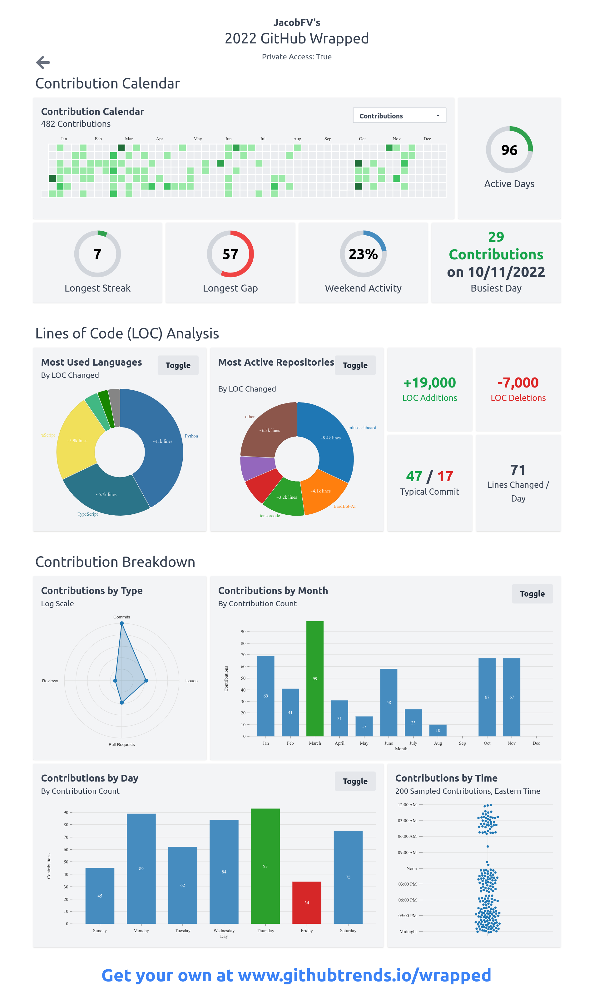

     

### Howdy 👋

I'm a machine learning engineer 👨‍🔬, roboticist 👨‍🏭, and entreprenuer 👨‍💼 at my startup, [Limboid LLC](https://limboid.ai), where I work to develop [artificial general intelligence (🖥️+🧠)](https://jacobfv.github.io/blog/the-master-plan-part-1/) and [affordable humanoid robots (🤖 −💲)](https://jacobfv.github.io/blog/the-master-plan-part-2/). During the day, I work as a software engineer 🧑‍💻 at Motio Inc. I recently graduated 🎉 from the University of Texas at Arlington with my bachelor's degree in computer science. I 💙 [open source work](https://github.com/JacobFV), [artificial intelligence](https://jacobfv.github.io/blog/category/ai/), and [robotics](https://jacobfvaldez.weebly.com/engineering.html). When I'm not interacting with artificial agents, you'll find me working with real people. [I hope that includes you 📫](https://jacobfv.github.io/bio#contact)

## Focus statement

The endless evolution of artificial intelligence (AI) penetrates nearly every research discipline, engineering domain, and human endeavor: expert systems automate innumerably-many business processes; large language models generate indistinguishably-plausible written content; deep generative models produce photorealistic images; reinforcement learning agents have even gone on to achieve superhuman-level performance in strategic action selection and execution. Problem domains, when formalized into data, are ripe territory for AI to conquer.

Yet AI has one Problem to tackle: its own evolution... [Read more >>](https://jacobfv.github.io/bio/focus-statement/)

## Stats

 
 

